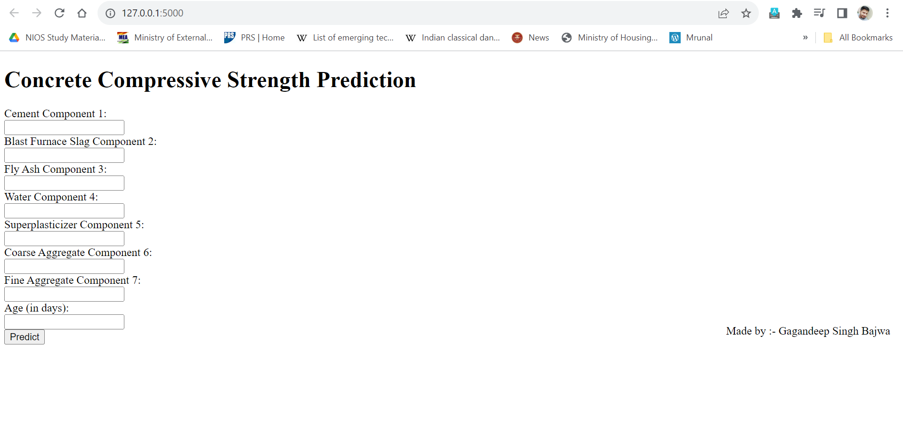
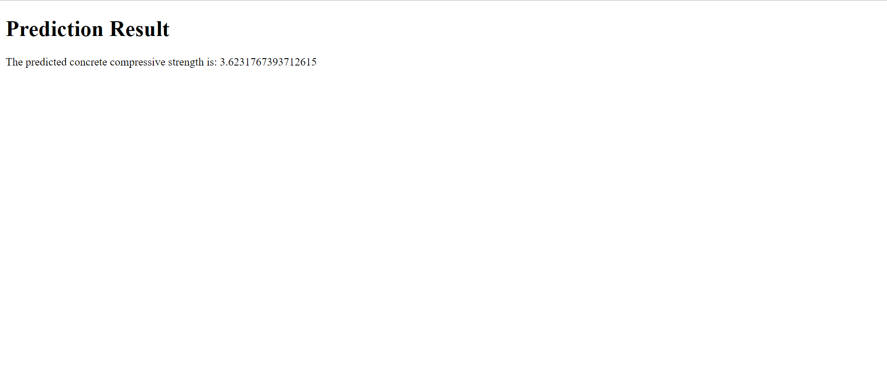

# CementStrength
# Workflows
1. Update config.yaml
2. Update secrets.yaml [Optional]
3. Update params.yaml
4. Update the entity
5. Update the configuration manager in src config
6. Update the components
7. Update the pipeline
8. Update the main.py

# Problem Statement
A construction company needs to predict concrete compressive strength in order to reduce cost and attain the required compressive strength. 
Therefore, in order to attain this task, I have built a regression model to predict concrete compressive strength when the features are fed to the model.

# Output:

Result Page:

# How to run?
## STEPS:
Clone the repository

https://github.com/gagan-bajwa/CementStrength.git

STEP 01- Create a conda environment after opening the repository
conda create -n cement python=3.8 -y
conda activate cement
STEP 02- Install the requirements
pip install -r requirements.txt
## Finally, run the following command:
python app.py
Now,

open up you local host and port
Author: Gagandeep Singh
Data Scientist
Email: gsb141991@gmail.com
# AWS-CICD-Deployment-with-Github-Actions

1. Login to AWS console.
2. Create IAM user for deployment

## with specific access

1. EC2 access : It is virtual machine

2. ECR: Elastic Container registry to save your docker image in aws

## Description: About the deployment

1. Build docker image of the source code

2. Push your docker image to ECR

3. Launch Your EC2 

4. Pull Your image from ECR in EC2

5. Lauch your docker image in EC2

 Policy:

1. AmazonEC2ContainerRegistryFullAccess

2. AmazonEC2FullAccess
3. Create ECR repo to store/save docker image
- Save the URI: demo >> 566373416292.dkr.ecr.us-east-1.amazonaws.com/catdog
4. Create EC2 machine (Ubuntu)
5. Open EC2 and Install docker in EC2 Machine:

        # optional

        sudo apt-get update -y

        sudo apt-get upgrade

        # required

        curl -fsSL https://get.docker.com -o get-docker.sh

        sudo sh get-docker.sh

        sudo usermod -aG docker ubuntu

        newgrp docker

6. Configure EC2 as self-hosted runner:
setting>actions>runner>new self hosted runner> choose os> then run command one by one

7. Setup github secrets:

    AWS_ACCESS_KEY_ID=

    AWS_SECRET_ACCESS_KEY=

    AWS_REGION = us-east-1

    AWS_ECR_LOGIN_URI = demo>>   025981777085.dkr.ecr.us-east-2.amazonaws.com

    ECR_REPOSITORY_NAME = cementstrength

